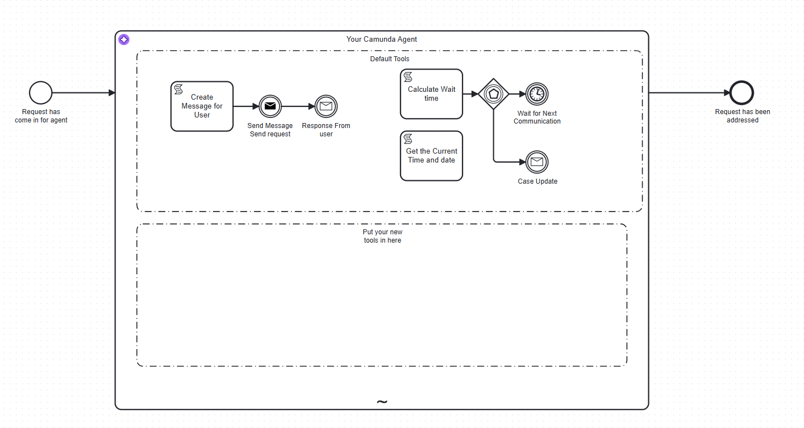
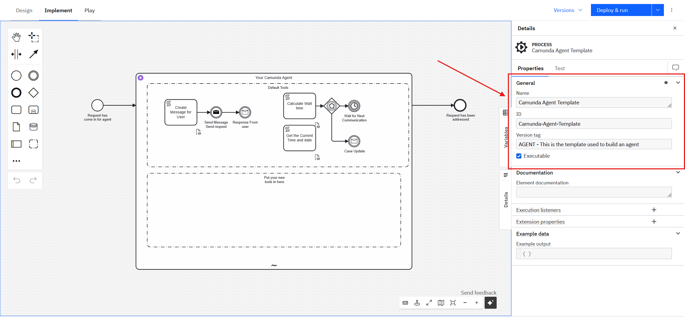
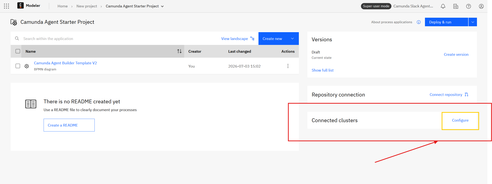

# Camunda Agent — Starter Template


https://raw.githubusercontent.com/NPDeehan/camunda-agent-template/refs/heads/main/img/processimage.png

This is a **ready-to-deploy starter template** for building a conversational AI agent hosted on Camunda 8. By the end of this tutorial you will have a working agent that users can talk to directly through the **`CamundaAgentHelper`** Slack bot — no Slack configuration required on your part. If you have never built a Camunda agent before and want a working starting point — this is it.

The template ships with:

- Built-in BPMN-native abilities to **wait for a user reply** or **pause for a period of time** before continuing — no custom code required.
- An **AI agent** backed by Claude Sonnet 4.6 on AWS Bedrock, wired up inside an ad-hoc sub-process.
- **Automatic discovery** — once deployed with the correct version tag, the agent is visible to the [Camunda Agent Routing Process](https://github.com/NPDeehan/Camunda-Agent-Routing-Process) and can be called by users immediately via `CamundaAgentHelper`.

You replace the sample domain logic with your own, keep what you need, and delete the rest.

---

## How it works

This template does not handle Slack communication directly — that is the responsibility of the **[Camunda Agent Routing Process](https://github.com/NPDeehan/Camunda-Agent-Routing-Process)**, a separate process that must be deployed on the same cluster. The routing agent listens for Slack `@mentions`, discovers available agents by scanning deployed processes for the `AGENT` version tag convention, and calls the right one as a child process. All Slack messaging flows through it.

Your agent communicates with the user by publishing a `MESSAGE_FOR_USER` BPMN message. The routing agent catches this, posts it to the Slack thread, waits for the user's reply, and sends it back as a `SendResponse` message. This means your process never touches Slack directly — you just send and receive BPMN messages.

```
User @mentions routing bot in Slack
        │
        ▼
Routing agent discovers agents (scans for AGENT in version tags)
        │
        ▼
Routing agent calls your process as a child, passing the user's question
        │
        ▼
┌───────────────────────────────────────────┐
│  AI Agent (ad-hoc sub-process)            │
│  Model: Claude Sonnet 4.6 on Bedrock      │
│                                           │
│  Available tools:                         │
│  ├─ Send message to user (via routing)    │
│  ├─ Get current time / date               │
│  └─ Wait for a set duration              │
└───────────────────────────────────────────┘
        │
        ▼
Agent publishes MESSAGE_FOR_USER
        │
        ▼
Routing agent posts to Slack thread → waits for reply → returns SendResponse
        │
        ├─ User replies → agent loops with follow-up
        └─ Timeout → process ends
```

---

## Prerequisites

Before starting you will need:

- A **Camunda 8 SaaS** account with a cluster on **version 8.9 or later**.
  Sign up at [camunda.com](https://camunda.com) if you do not have one. (If you're a Camundi, you don't need to do this — we already have a cluster for you and you can ask to be invited.)
- An **AWS account** with Amazon Bedrock enabled and access to the model `us.anthropic.claude-sonnet-4-6` in your chosen region.
  *(May not be needed if you are using a Camunda-provided development cluster — see Step 5.)*
- The **[Camunda Agent Routing Process](https://github.com/NPDeehan/Camunda-Agent-Routing-Process)** deployed on the same cluster — this handles all Slack communication and agent discovery on behalf of your agent.
  🤖 If you're a Camundi building on the shared development cluster, this is already running. You don't need to set it up.

---

## Step 1 — Add the BPMN to your Camunda project

1. Log in to [Camunda Web Modeler](https://modeler.camunda.io).
2. Click **Create new project** and give it a name.
3. Inside the project, click **Add file** → **Browse blueprints**. Search for **Camunda Agent Starter** and select it. The BPMN will be added to your project automatically.


https://raw.githubusercontent.com/NPDeehan/camunda-agent-template/refs/heads/main/img/Choosing%20the%20blueprint.png

---

## Step 2 — Configure the model

Once the BPMN is loaded, make these three changes in Web Modeler before doing anything else. They must be unique to your deployment, especially if you are sharing a cluster with others.

### 2a. Set a unique Process Name and ID

1. Click on an empty area in the canvas (not on any element) to select the process itself. Make sure you're on the **Implement** tab at the top — there are three tabs: Design, Implement, and Play.
2. In the properties panel (named **Details**), update **Name** to something descriptive and unique, e.g. `Alice's Support Agent`.
3. Update **ID** to a unique identifier using only letters, numbers, and hyphens, e.g. `alice-support-agent`.

If two people deploy this template to the same cluster with the default ID `Camunda-Agent-Template`, their deployments will overwrite each other.

### 2b. Update the Version Tag

The **Version Tag** serves two purposes: it tells users what your agent does, and it is how the routing agent discovers your process. The routing agent queries all deployed processes on the cluster and surfaces any whose version tag contains the string `AGENT`. The text after `AGENT -` becomes the description it shows to the user when they ask what agents are available.

1. With the process still selected (empty canvas area), find the **Version Tag** field in the properties panel.
2. Replace the default value with your own description in this format:
   ```
   AGENT - A short sentence explaining what your agent does
   ```
   For example: `AGENT - Helps customers track and manage their support tickets`

If the version tag does not start with `AGENT`, the routing agent will not find your process and users will not be able to reach it.


https://raw.githubusercontent.com/NPDeehan/camunda-agent-template/refs/heads/main/img/agnetPropertiesPanel.png

---

## Step 3 — Connect your cluster to the project

Before you can deploy, you need to link your Camunda cluster to the Web Modeler project.

1. Click the **back arrow** to return to the project view (the list of files in your project).
2. In the right sidebar, click **Connected clusters**.
3. In the dropdown, select the cluster you want to deploy to.

The cluster is now set as the deployment target for every BPMN in this project.


https://raw.githubusercontent.com/NPDeehan/camunda-agent-template/refs/heads/main/img/ConfigureServer.png

---

## Step 4 — Deploy the process

1. Open `Camunda Agent Builder Template V2.bpmn` in Web Modeler.
2. In the top-right corner you will see a **Deploy and Run** button — do **not** click this directly. Instead, click the **down arrow** beside it and select **Deploy** from the dropdown.

> **Expected warnings:** You may see warnings about secrets that do not exist yet (`AWS_…`). This is normal — the secrets will be added in the next step. The deployment will still succeed.

---

## Step 5 — Configure AWS credentials *(skip if you have been given access to a demo cluster)*

> **Using a Camunda-provided development cluster?** Dev clusters often come with Bedrock model access pre-configured at the cluster level. Try running the agent first — if it fails to invoke the model, come back here and add the AWS secrets manually.

🤖 Not needed if you're using the Camunda Bot — it's already set up.

If you are using your own cluster or the agent cannot reach Bedrock, you need an IAM user or role with `bedrock:InvokeModel` permission on `us.anthropic.claude-sonnet-4-6`. See the AWS guide [Creating IAM users](https://docs.aws.amazon.com/IAM/latest/UserGuide/id_users_create.html) if you need to create one (choose **Application running outside AWS** as the use case).

> **Add to your Camunda cluster** — Log in to [Camunda Console](https://console.camunda.io) → your cluster → **Secrets** tab → **Create new secret**. Create all three:
> - **Name:** `AWS_REGION` — **Value:** your Bedrock-enabled region, e.g. `us-east-1`
> - **Name:** `AWS_ACCESS_KEY` — **Value:** the IAM access key id
> - **Name:** `AWS_SECRET_KEY` — **Value:** the IAM secret access key
>
> 🤖 Camunda employees: ask the Camunda Slack bot to create these secrets in the cluster for you.

---

## Step 6 — Open Operate so you can watch your process run

Before you trigger the test, open Camunda Operate so you are ready to watch the process in real time as soon as it starts.

1. Go to Camunda Operate and log in to the same cluster you deployed to.
2. In the left sidebar, click **Processes** and find your process by the name you gave it in Step 2a.
3. Click on the process to see a list of instances — it will be empty for now, but leave this tab open.

Once a test instance starts (in Step 7), you can click into it and watch the BPMN diagram with a coloured token showing exactly where execution currently is. When the agent is thinking or calling a tool, the token will sit inside the ad-hoc sub-process. You can watch it move through the timer event, the current time script task, and back out again in real time.

If something went wrong — for example the agent never replied — Operate will show you any incidents or error messages on the failed element, which makes debugging straightforward.

---

## Step 7 — Test it

Before testing, re-deploy the process to pick up all the configuration changes made since Step 4. Open the BPMN in Web Modeler, click the **down arrow** beside the **Deploy and Run** button in the top-right corner, and select **Deploy**.

1. In Slack, `@mention` the `CamundaAgentHelper` bot in any channel it is in.
2. It will scan the cluster for deployed agents. When it finds yours (by the `AGENT` version tag), it will offer to connect you to it — select your agent.
3. Once connected, send it this message:

   ```
   In 10 seconds can you tell me the current time in Jakarta?
   ```

   This is an ideal first test because it exercises two built-in tools at once — the timer wait and the current time lookup.

4. Switch to the Operate tab you opened in Step 6 — you should see a new instance appear. Click it to watch the token move through the process in real time.
5. After 10 seconds you should receive a reply with the Jakarta time in the Slack thread.

If no reply arrives, check that the version tag on your deployed process starts with `AGENT` and that you re-deployed after making any changes. Operate will show any incidents or errors on the failed element.

---

## Bonus features

These are optional enhancements you can tackle in any order — pick whichever sounds most fun.

### Bonus 1 — Give your agent some personality

By default the system prompt is fairly dry. You can make your agent far more interesting by replacing the opening paragraph with a vivid personality description.

1. In Web Modeler, click on the **AI Agent (ad-hoc sub-process)** element (the large rounded rectangle that contains the agent tasks).
2. In the properties panel on the right, find the **System Prompt** input field.
3. Replace the first paragraph with a personality of your choosing. The rest of the prompt (tool descriptions, response rules, etc.) can stay as-is.

For example, something completely over the top:

```
You are Captain Reginald von Timestamps III, a retired 18th-century naval officer 
who was inexplicably transported to the present day and now works as a timezone 
assistant. You are deeply suspicious of digital clocks, refer to all time zones 
as "distant seas", and cannot resist adding a brief nautical anecdote to every 
response. You are unfailingly polite but increasingly baffled by modernity.
```

Re-deploy the process after saving, then test it in Slack — the difference in tone is immediate.

### Bonus 2 — Give your agent access to the latest news

You can give your agent a live news search capability by wiring up a REST connector that calls **The Guardian's public API**. Once added, the agent will automatically call this tool whenever a user asks about current events or news on a topic.

#### Step 1 — Add a new task inside the agent

Inside the ad-hoc sub-process, find the area labelled **"put your new tools here"**.

1. From the element palette on the left, drag a **Task** (the plain rectangle) and drop it inside that area.

> If you accidentally drop it outside the sub-process boundary the agent won't be able to use it. Make sure the sub-process border highlights when you hover before you release.

#### Step 2 — Change the task type to a REST connector

1. Click the task to select it.
2. In the context menu that appears next to the element, click the **first icon** (it looks like a rectangle in front of a square) to open the change-type picker.
3. Search for `REST` and select the **REST connector**.

#### Step 3 — Name the task

1. In the properties panel on the right, find the **Name** field.
2. Give the task a clear name — for example: `Get Latest News on Topic`.

The name is what the agent uses to refer to this tool internally, so make it obvious what the tool does.

#### Step 4 — Write the tool description

The agent decides *when* to use a tool based on the **Element documentation** field — this becomes the tool description the LLM sees.

1. In the properties panel, find the **Element documentation** field.
2. Write a description of what the tool does and when to call it. For example:

   ```
   Use this tool to find the latest news articles on a given topic. 
   Call it when the user asks about current events, recent news, 
   or wants to know what is happening in a particular area.
   ```

#### Step 5 — Configure the URL

The URL uses a `fromAI` function so the agent can dynamically fill in the search topic at runtime.

1. In the properties panel, find the **URL** input field.
2. Paste in the following expression:

   ```
   "https://content.guardianapis.com/search?api-key=test&page-size=5&q="
   + fromAi(toolCall.topicToSearch, "this is the topic you want to search for. The format requests that you don't use spaces, use '+' instead")
   +"&show-fields=headline%2Cbyline"
   ```

The `fromAi(...)` call tells the AI agent framework to ask the LLM to fill in that value at the point the tool is called. The second argument is the instruction the LLM sees — so it knows to format the topic with `+` instead of spaces.

#### Step 6 — Configure the result expression

After the connector runs, the result needs to be handed back to the LLM in a format it can read.

1. In the properties panel, find the **Result expression** field (under the Output section).
2. Paste in the following:

   ```
   {
     toolCallResult: response.body
   }
   ```

This maps the HTTP response body into `toolCallResult`, which is the variable the AI agent task reads to get the tool's output.

#### Step 7 — Re-deploy and test

Click **Deploy** and then ask your agent about a news topic, for example:

```
What is the latest news on artificial intelligence?
```

The agent should call the news tool, retrieve the Guardian headlines, and summarise them in its reply.

---

## Built-in BPMN capabilities

The template includes two built-in agent tools that are implemented entirely in BPMN — no external service required.

### Get the current time and date

The agent has access to a **Get the Current Time and date** tool, which is a BPMN script task that evaluates `now()` and returns the current timestamp. The agent uses this whenever it needs to reason about time, schedule actions, or tell the user what time it is.

### Wait for a duration

The agent has access to a **Wait for Next Communication** tool, which is a BPMN timer intermediate event. When the agent calls this tool it passes an [ISO 8601 duration](https://en.wikipedia.org/wiki/ISO_8601#Durations) string (e.g. `PT30M` for 30 minutes, `P1D` for one day). The process pauses for exactly that duration using Camunda's native timer, then automatically resumes.

This is useful for agents that check back later, send reminders, or implement scheduled follow-ups — with no external scheduler or custom code.

---

## Customising the template

### Swap in your own agent logic

The agent's system prompt is on the **AI Agent (ad-hoc sub-process)** element. Click it in Web Modeler and update the `System Prompt` input to describe what your agent should do.

### Add or remove tools

Any BPMN element inside the ad-hoc sub-process is a potential tool. Add a new service task (HTTP connector, script task, etc.) and give it a clear **Documentation** description — that description becomes the tool description the LLM sees. Remove sample tools you do not need by selecting them and pressing Delete.

### Change the model

The AI Agent task currently points at `us.anthropic.claude-sonnet-4-6` on AWS Bedrock. You can change this to any other Bedrock model, or switch the provider entirely to OpenAI, Anthropic direct, or Azure OpenAI by changing the **Provider type** input on the same task.

---

## File reference

| File | Purpose |
|------|---------|
| `Camunda Agent Builder Template V2.bpmn` | The main process definition — AI agent, timer events, message handling, and conversation flow. |
